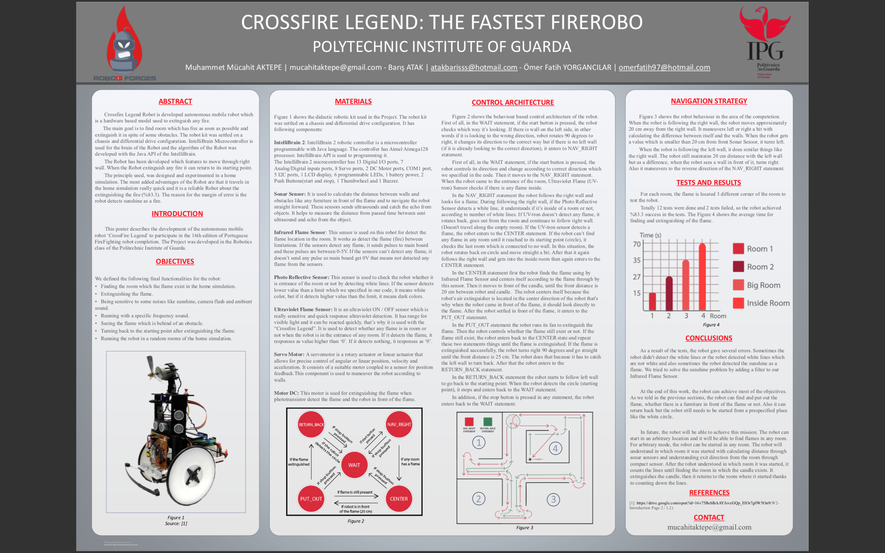

Competed in 16th Portugal National Robotic Competition. Developed a fire-fighting robot. Worked on software side with Java. Placed 3rd place in general category.
https://www.youtube.com/watch?v=1eQzGUBcxXw

